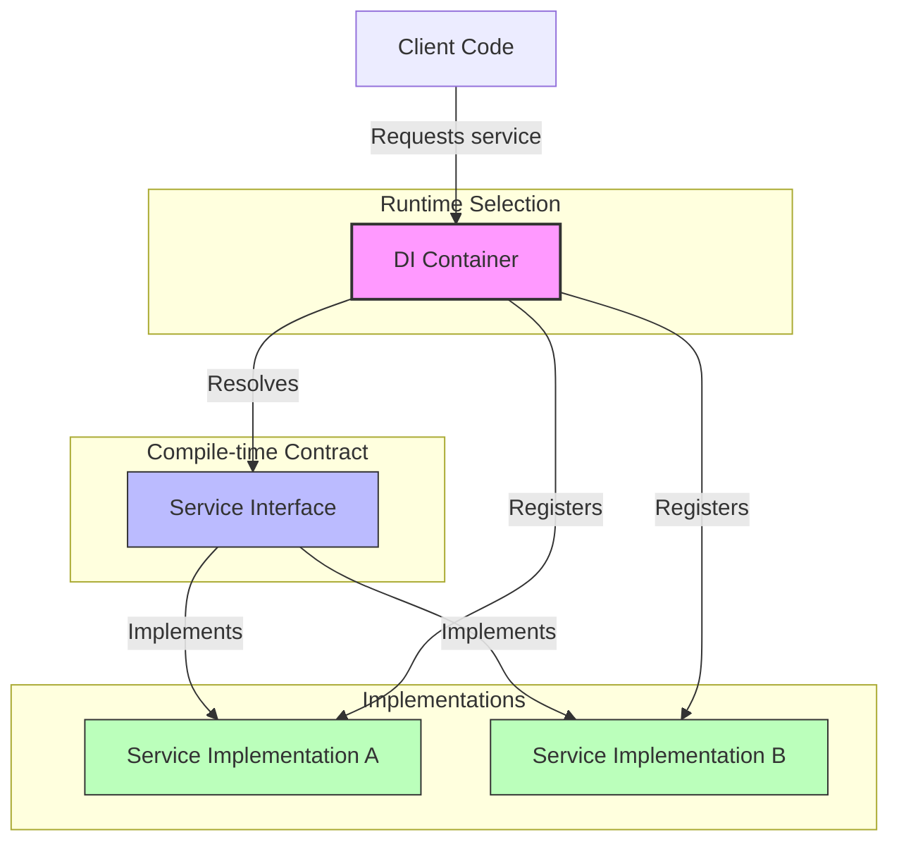
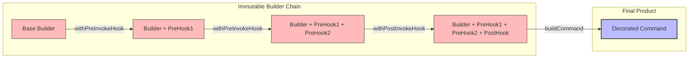
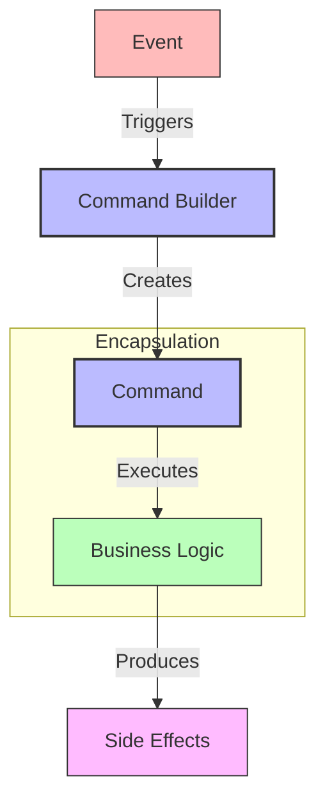
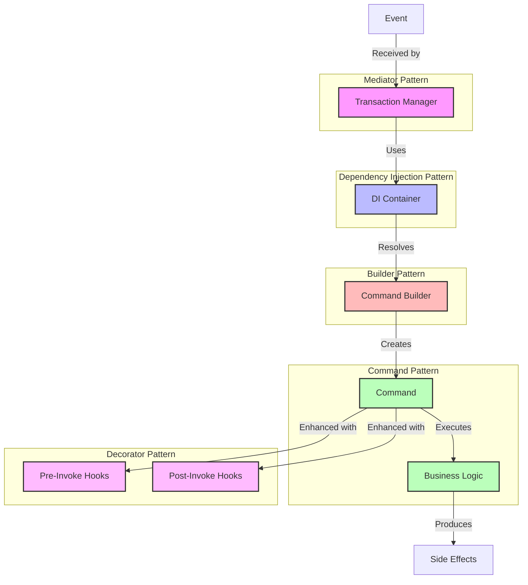

# DI Rally - Design Pattern Demo

This project demonstrates a dependency injection (DI) pattern for a command-based system. It showcases how to use various design patterns including:

- Dependency Injection
- Builder Pattern
- Command Pattern
- Factory Pattern
- Decorator Pattern

## Features

- Clean separation of concerns
- Flexible capability composition
- Type-safe dependency injection
- Runtime configuration of behavior stacks

## Getting Started

### Prerequisites

- Node.js (v14 or later)
- npm or yarn

### Installation

```bash
npm install
```

### Running the Demo

```bash
npm start
```

## Project Structure

- `core/`: Core interfaces and implementations
  - `di-container.ts`: Dependency injection container
  - `command-builder.ts`: Builder pattern implementation
  - `transaction-manager.ts`: Command orchestration
  - `types.ts`: Type definitions
- `commands/`: Command implementations
- `services/`: Service implementations
- `hooks/`: Capability hooks for extending functionality

## The "withX" Pattern

The project demonstrates the "withX" pattern which allows for composing capabilities onto commands:

```typescript
const enhancedBuilder = commandBuilder
  .withPreInvokeHook(createLoggingHook(logger))
  .withPreInvokeHook(createValidationHook(validator))
  .withPostInvokeHook(createMetricsHook(metricsService));
```

This pattern is particularly powerful for building maintainable, modular systems that can evolve over time.

## Design Pattern Visualizations

The following diagrams visualize the key design patterns used in this project and how they work together.

### Dependency Injection Pattern



**Benefits:**
- Loose coupling between components
- Easy to swap implementations
- Simplified testing with mock implementations
- Centralized dependency management

### Builder Pattern with "withX" Methods



**Benefits:**
- Fluent interface for configuration
- Immutable builder instances
- Clear separation between construction and representation
- Flexible capability composition

### Command Pattern



**Benefits:**
- Encapsulates business operations
- Decouples sender from receiver
- Enables command history and undo operations
- Supports queueing and prioritization

### How Patterns Work Together



**Benefits of Combined Patterns:**
- Clean separation of concerns
- Highly testable components
- Flexible capability composition
- Extensible architecture that evolves gracefully