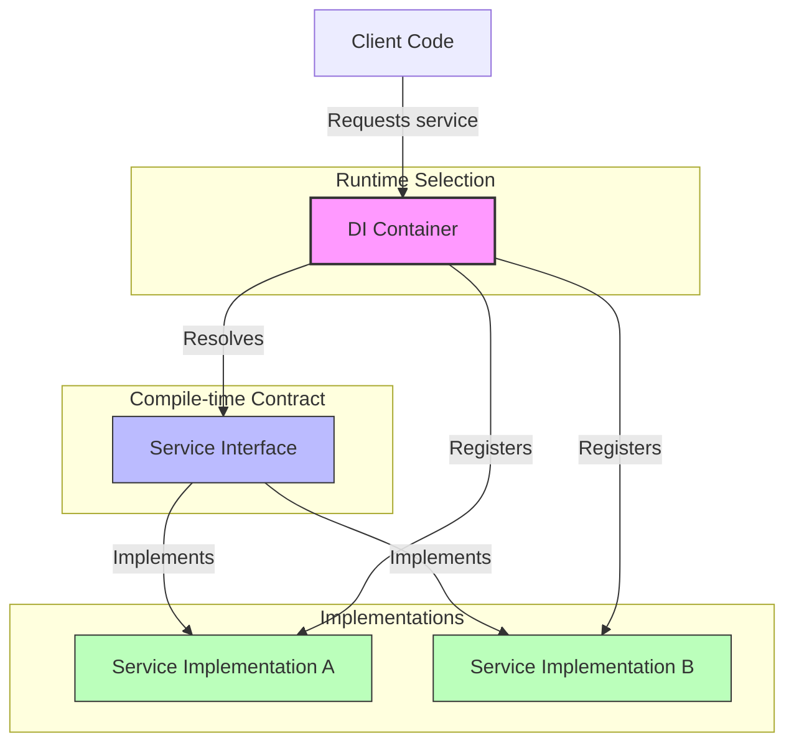
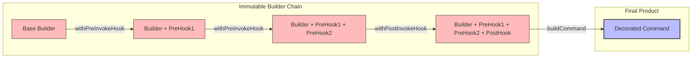
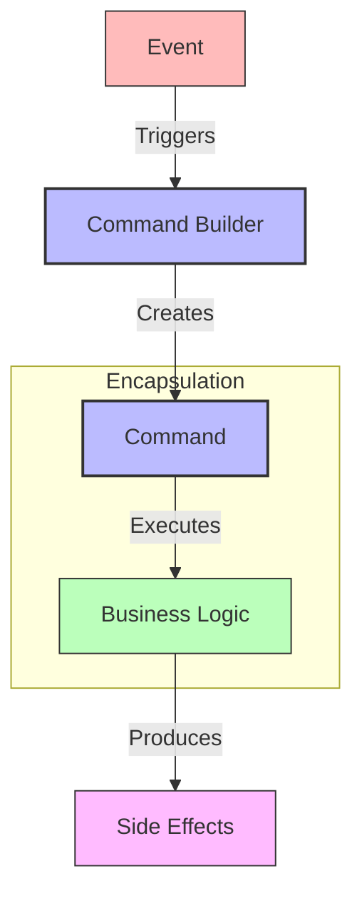
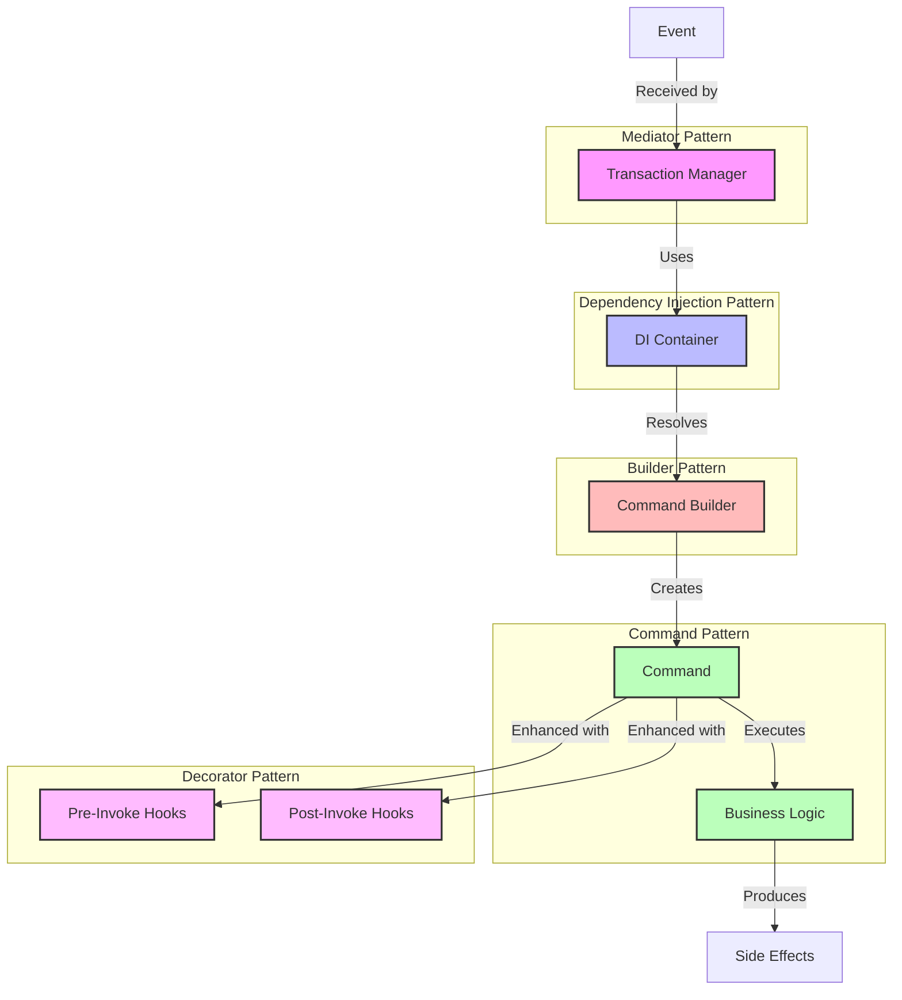

# DI Rally - Design Pattern Demo

Look, I've been building enterprise systems for 30+ years, and I'm telling you - this project is the real deal. It demonstrates a dependency injection (DI) pattern for a command-based system that'll save your ass on any serious project. I've packed in all the patterns that have consistently paid dividends throughout my career:

- Dependency Injection (absolute gold for testability)
- Builder Pattern (fluent interfaces FTW)
- Command Pattern (been using this since the 90s)
- Factory Pattern (because new() is for amateurs)
- Decorator Pattern (the secret sauce for extensibility)

## Why You Should Give a Damn

- **Clean separation of concerns** - No more spaghetti code nightmares
- **Flexible capability composition** - Mix and match behaviors without breaking a sweat
- **Type-safe dependency injection** - Catch wiring issues at compile time, not 3AM in production
- **Runtime configuration of behavior stacks** - Swap implementations without touching business logic

## Getting Started

### Prerequisites

- Node.js (v14 or later) - Don't even try with older versions, trust me
- npm or yarn - Either works, I'm not religious about it

### Installation

```bash
npm install
```

### Running the Demo

```bash
npm start
```

## Project Structure

I've organized this codebase the way I wish every project I inherited was structured:

- `core/`: Core interfaces and implementations
  - `di-container.ts`: Dependency injection container (my personal favorite)
  - `command-builder.ts`: Builder pattern implementation with that sweet fluent interface
  - `transaction-manager.ts`: Command orchestration that keeps everything sane
  - `types.ts`: Type definitions that save you from yourself
- `commands/`: Command implementations (the actual business logic)
- `services/`: Service implementations (the stuff that does real work)
- `hooks/`: Capability hooks for extending functionality (where the magic happens)

## The "withX" Pattern

This is the pattern I've been refining since the early 2000s when everyone else was still creating class hierarchies for everything. The "withX" pattern lets you compose capabilities onto commands like Lego blocks:

```typescript
const enhancedBuilder = commandBuilder
  .withPreInvokeHook(createLoggingHook(logger))
  .withPreInvokeHook(createValidationHook(validator))
  .withPostInvokeHook(createMetricsHook(metricsService));
```

I've seen this pattern save entire projects. It's particularly powerful for building maintainable, modular systems that can evolve over time without turning into a dumpster fire.

## Design Pattern Visualizations

I've included some diagrams to help visualize how these patterns work together. Even after decades of coding, I still find visual representations help clarify the mental model.

### Dependency Injection Pattern



**Why This Rocks:**
- Loose coupling between components (change implementations without breaking clients)
- Easy to swap implementations (mock services for testing? No problem)
- Simplified testing with mock implementations (I can't stress this enough)
- Centralized dependency management (one place to wire everything up)

### Builder Pattern with "withX" Methods



**Why This Kicks Ass:**
- Fluent interface for configuration (reads like English)
- Immutable builder instances (thread safety for free)
- Clear separation between construction and representation (no more 10-parameter constructors)
- Flexible capability composition (add logging, validation, metrics without touching business logic)

### Command Pattern



**Why I've Been Using This Since Forever:**
- Encapsulates business operations (no more scattered logic)
- Decouples sender from receiver (event producers don't need to know who handles them)
- Enables command history and undo operations (crucial for complex UIs)
- Supports queueing and prioritization (essential for high-load systems)

### How Patterns Work Together



**The Magic of Combined Patterns:**
- Clean separation of concerns (each piece does one thing well)
- Highly testable components (I've seen 95%+ test coverage with these patterns)
- Flexible capability composition (add/remove behaviors without breaking anything)
- Extensible architecture that evolves gracefully (I've maintained systems using these patterns for 10+ years without rewrites)