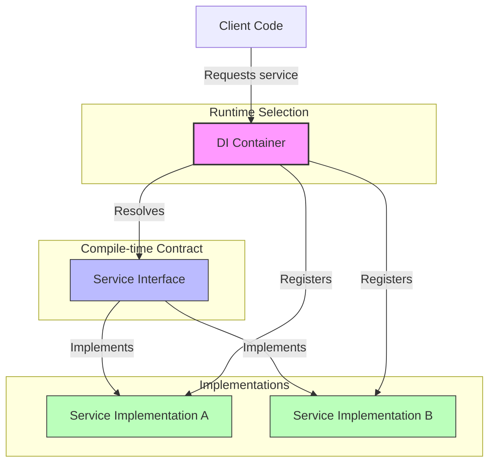
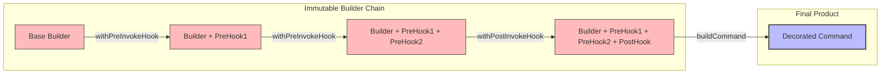
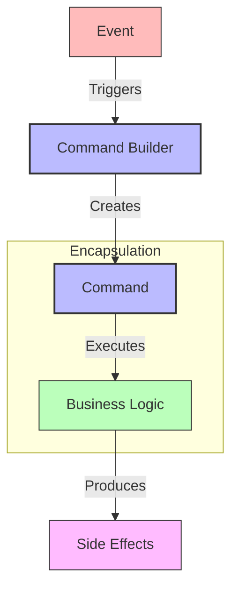

# DI Rally - Design Pattern Demo

I spent so many years "studying" these patterns from my first intern job in 2000 and
thinking all these senior engineers were amazing - and it was a defense contractor so
they were all at least 20 years older than me. They had this mystique surrounding them
and I wanted to sling components and shit around (they were CORBA components in case you
wondering what kind of components i wanted to sling).  SO i read that f#$*$& Gang of Four
book a hundred times. And then concluded I was just an idiot because I just couldn't see
the value in any of it. 

Definitely did not need that fully story to make this point but you just can't learn this
shit at all from reading it - it just like playing the piano. If you use it all the time - 
even incorrectly - actually, more that way, because  you'll definitely remember digging youself
out when the wrongness hits you and you go "damn ok, mental note - so that's why you shouldn't require
a reference to the parent.." or something like that.

- Dependency Injection (just use it all the time)
- Builder Pattern (this one you probably know and use all the time)
- Command Pattern (top 3)
- Factory Pattern (.new() is for trivial things. everything else should have creation encapsulated)
- Decorator Pattern (kinda like a builder, but for runtime behavior. My way to differentiate is thinking of the
builder as a construction crew building your house. You don't live there yet. A decorator is like the two guys delivering 
you sofa from Raymour and Flanigan and they're 2 hours late so it ruined your whole day but at least you live in your house
because that was my analogy for "runtime" you're welcome. 

## Why You Should Give a Damn

- **Clean separation of concerns** -like those goddamn wires i packup every day in my backpack and no matter what they're as tangled as a possible. Entropy basically. It'll attack even a clean codebase, but then you can laugh at the arrow of time instead of cry
- **Flexible capability composition** - Mix and match behaviors without breaking a sweat
- **Type-safe dependency injection** - Catch wiring issues at compile time, not 3AM from a pager duty buzz
- **Runtime configuration of behavior stacks** - Swap implementations without touching business logic

## Getting Started

### Prerequisites

- node
- npm or yarn - Either works, but let's be honest no one uses yarn. I put it there so you know I care about you and your feelings ad
weird tech stack decisions :)

### Installation

```bash
npm install
```

### Running the Demo

```bash
npm start
```

## Project Structure

I've organized this codebase the way I wish every project I inherited was structured:

- `core/`: Core interfaces and implementations
  - `di-container.ts`: Dependency injection container (my personal favorite)
  - `command-builder.ts`: Builder pattern implementation 
  - `transaction-manager.ts`: Command orchestration
  - `types.ts`: Type definitions
- `commands/`: Command implementations (the actual business logic)
- `services/`: Service implementations (this word is a bit overloaded. It's really just a 
logical collection of functions where EVER DEPENDENCY IS INJECTED. The controller should 
take a request and delegate it to a service)
- `events/`:  events for stateless messaging between components

## The Builder Pattern

 The builder pattern lets you compose capabilities onto commands like Lego blocks:

```typescript
const enhancedBuilder = commandBuilder
  .withPreInvokeHook(createLoggingHook(logger))
  .withPreInvokeHook(createValidationHook(validator))
  .withPostInvokeHook(createMetricsHook(metricsService));
```
particularly powerful for building maintainable, modular systems that can evolve over time without turning into a dumpster fire.

## Design Pattern Visualizations

I've included some diagrams to help visualize how these patterns work together. Even after decades of coding, I still find visual representations help clarify the mental model.

### Dependency Injection Pattern



**Why This Neato:**
- Loose coupling between components (change implementations without breaking clients)
- Easy to swap implementations (mock services are super easy now)
- Simplified testing with mock implementations (I can't stress this enough)
- Centralized dependency management (one place to wire everything up)

### Builder Pattern with "withX" Methods



**Why This is also Neato:**
- Fluent interface for configuration (reads like English, the same language you should be coding in by now)
- Immutable builder instances (thread safety)
- Clear separation between construction and representation (no more 10-parameter constructors)
- Flexible capability composition (add logging, validation, metrics without touching business logic)

### Command Pattern



**Why I've Been Using This Since Forever:**
- Encapsulates business operations (no more scattered logic)
- Decouples sender from receiver (event producers don't need to know who handles them)
- Enables command history and undo operations (crucial for TRANSACTIONS)
- Basically essential for building maintainable, modular systems that can evolve over time without turning into a sad codeclown
(i don't know what that means but i'm super tired. Codeclown)

### How Patterns Work Together


Just use em k