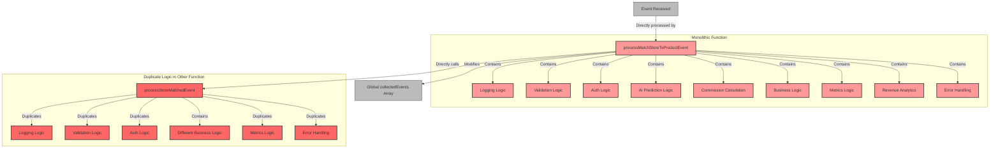

# No Patterns Example

This directory contains a demonstration of what the same functionality would look like **without** using proper design patterns. It's deliberately implemented in a "messy" way to highlight the problems that arise when not using patterns.

## Purpose

The purpose of this example is to:

1. Show the contrast between pattern-based and non-pattern-based code
2. Demonstrate why patterns are important
3. Illustrate the problems that patterns solve
4. Help developers appreciate the value of design patterns

## Problems Demonstrated

The code in this directory demonstrates the following problems:

### 1. Tight Coupling

Components directly depend on each other, making it hard to change one part without affecting others. For example:
- The event processing functions directly call the logger, validation, and authorization functions
- The `processMatchStoreToProductEvent` function directly calls `processStoreMatchedEvent`

### 2. Poor Separation of Concerns

Business logic is mixed with infrastructure concerns:
- Logging, validation, and authorization logic is embedded within business logic
- Event processing and error handling are intermingled

### 3. Code Duplication

The same logic is repeated in multiple places:
- Validation logic is duplicated across event handlers
- Authorization checks are duplicated
- Error handling is duplicated

### 4. Hard to Test

The code is difficult to test because:
- Dependencies can't be easily mocked
- Functions have side effects
- Business logic is mixed with infrastructure

### 5. Hard to Extend

Adding new features requires changing existing code:
- Adding a new event type requires modifying the main processing functions
- Adding new capabilities (like analytics) requires modifying every handler

### 6. Brittle

Changes in one part of the code can easily break other parts:
- Changing the validation logic might break the event handlers
- Changing the event structure affects multiple places

## How to Run

To run this example:

```bash
cd no-patterns-example
npx ts-node index.ts
```

## Problems Visualized

The following diagram illustrates the problems with the no-patterns approach:



### Key Problems Highlighted

1. **Tight Coupling** - Components directly reference each other
   ```mermaid
   graph LR
       A[processMatchStoreToProductEvent] -->|Directly calls| B[processStoreMatchedEvent]
       A -->|Directly calls| C[logMessage]
       A -->|Directly calls| D[validateEvent]
       A -->|Directly calls| E[checkAuthorization]
       A -->|Directly modifies| F[collectedEvents]
   ```

2. **Poor Separation of Concerns** - Business logic mixed with infrastructure
   ```mermaid
   graph TD
       A[Business Logic] --- B[Logging Logic]
       A --- C[Validation Logic]
       A --- D[Authorization Logic]
       A --- E[Error Handling]
       A --- F[Metrics Recording]
       
       subgraph "Single Function Scope"
           A
           B
           C
           D
           E
           F
       end
   ```

3. **Code Duplication** - Same logic repeated in multiple functions
   ```mermaid
   graph LR
       subgraph "processMatchStoreToProductEvent"
           A1[Validation Logic]
           B1[Auth Logic]
           C1[Logging Logic]
           D1[Error Handling]
       end
       
       subgraph "processStoreMatchedEvent"
           A2[Validation Logic]
           B2[Auth Logic]
           C2[Logging Logic]
           D2[Error Handling]
       end
       
       A1 -.->|Duplicated| A2
       B1 -.->|Duplicated| B2
       C1 -.->|Duplicated| C2
       D1 -.->|Duplicated| D2
   ```

## Contrast with Pattern-Based Approach

For comparison, the main project demonstrates how these problems are solved using:

1. **Dependency Injection Pattern**: Loose coupling between components
   ```mermaid
   graph TD
       A[Client] -->|Depends on| B[Interface]
       B <--| Implements| C[Implementation A]
       B <--| Implements| D[Implementation B]
       E[DI Container] -->|Creates| C
       E -->|Creates| D
       E -->|Provides| A
   ```

2. **Builder Pattern**: Flexible object creation
   ```mermaid
   graph LR
       A[Builder] -->|withPreHook| B[Builder']
       B -->|withPostHook| C[Builder'']
       C -->|buildCommand| D[Command]
   ```

3. **Command Pattern**: Encapsulation of business operations
   ```mermaid
   graph TD
       A[Command Interface] <--| Implements| B[Command A]
       A <--| Implements| C[Command B]
       D[Client] -->|Uses| A
   ```

4. **Decorator Pattern**: Separation of cross-cutting concerns
   ```mermaid
   graph TD
       A[Core Object] -->|Decorated by| B[Logging Decorator]
       B -->|Decorated by| C[Validation Decorator]
       C -->|Decorated by| D[Metrics Decorator]
   ```

5. **Factory Pattern**: Centralized object creation
   ```mermaid
   graph TD
       A[Event Type] -->|Passed to| B[Command Factory]
       B -->|Creates| C[Command A]
       B -->|Creates| D[Command B]
       B -->|Creates| E[Command C]
   ```

6. **Strategy Pattern**: Interchangeable algorithms
   ```mermaid
   graph TD
       A[Context] -->|Uses| B[Strategy Interface]
       B <--| Implements| C[Strategy A]
       B <--| Implements| D[Strategy B]
   ```

7. **Mediator Pattern**: Coordinated interactions
   ```mermaid
   graph TD
       A[Component A] -->|Uses| M[Mediator]
       B[Component B] -->|Uses| M
       C[Component C] -->|Uses| M
       M -->|Coordinates| A
       M -->|Coordinates| B
       M -->|Coordinates| C
   ```

The pattern-based approach results in code that is:
- More maintainable
- Easier to test
- More flexible
- More extensible
- Less prone to bugs

## Learning from This Example

By studying both approaches, developers can gain a deeper understanding of:
- Why patterns exist
- What problems they solve
- When to apply them
- How they improve code quality

Remember: This example is deliberately bad to illustrate what not to do!