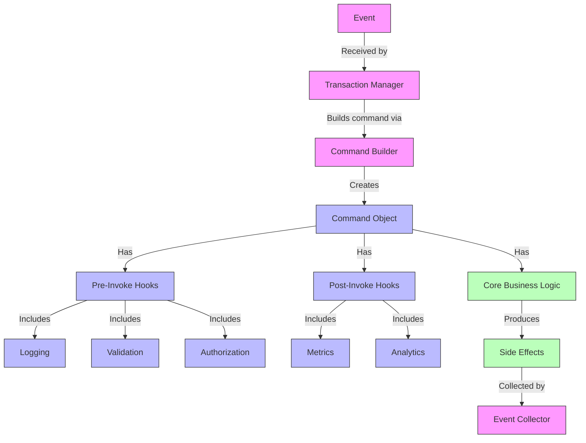
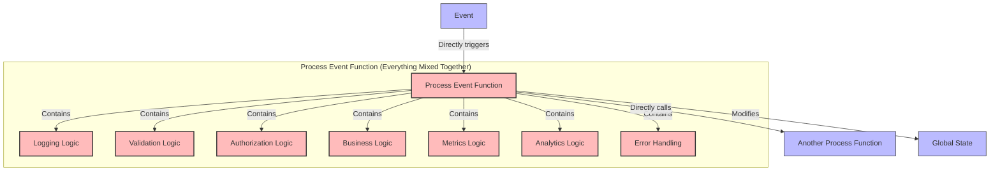
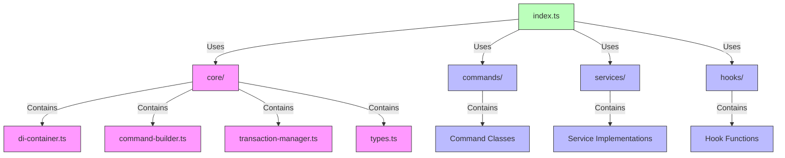
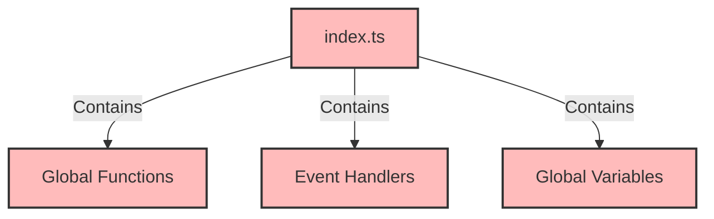

# Pattern vs. No-Pattern Comparison

This document provides a side-by-side comparison of the pattern-based and non-pattern-based approaches to the same functionality.

## Event Processing

### Pattern-Based Approach

```typescript
// In transaction-manager.ts
async processEvent(event: TransactionEvent): Promise<void> {
  try {
    // Build command with all registered capabilities
    const command = this.commandBuilder.buildCommand(event);
    
    // Prepare context for command execution
    const context: CommandContext = {
      event,
      state: {}, 
      eventCollector: this.eventCollector
    };
    
    // Execute command with all its hooks
    await command.invoke(context);
  } catch (error) {
    await this.handleError(event, error as Error);
  }
}
```

### No-Pattern Approach

```typescript
// In no-patterns-example/index.ts
function processMatchStoreToProductEvent(event: any): void {
  try {
    // Logging logic mixed with business logic
    logMessage(`⚡ Executing match store command for event ${event.type}`);
    
    // Validation logic mixed with business logic
    const isValid = validateEvent(event.type, event.payload);
    if (!isValid) {
      throw new Error(`Invalid event payload for ${event.type}`);
    }
    
    // Authorization logic mixed with business logic
    const isAuthorized = checkAuthorization(event.metadata.source, event.type);
    if (!isAuthorized) {
      throw new Error(`Unauthorized source: ${event.metadata.source}`);
    }
    
    // AI prediction logic mixed with business logic
    // ... 30+ lines of prediction logic ...
    
    // Commission calculation logic mixed with business logic
    // ... 20+ lines of commission logic ...
    
    // Actual business logic for matching store to product
    // ... 30+ lines of business logic ...
    
    // Metrics logic mixed with business logic
    // ... metrics recording ...
    
    // Revenue analytics logic mixed with business logic
    // ... analytics calculations ...
    
  } catch (error) {
    // Error handling mixed with business logic
    logError(`Error processing event ${event.type}:`, error as Error);
  }
}
```

## Command Implementation

### Pattern-Based Approach

```typescript
// In match-store-command.ts
export class MatchStoreToProductCommand implements TransactionCommand {
  commandId = 'match-store-' + Math.random().toString(36).substring(2, 9);
  
  constructor(private event: TransactionEvent<{storeId: string, productList: any[]}>) {}
  
  async invoke(context: CommandContext): Promise<void> {
    // Business logic only
    console.log(`🏪 Matching store ${this.event.payload.storeId} to products`);
    
    // Generate match ID
    const matchId = 'MATCH-' + Math.random().toString(36).substring(2, 9).toUpperCase();
    
    // Calculate potential revenue
    const potentialRevenue = this.event.payload.productList.reduce((sum, product) => {
      return sum + (product.price * product.estimatedVolume);
    }, 0);
    
    // Create a side effect event
    context.eventCollector.addEvent({
      // Event details
    });
  }
}
```

### No-Pattern Approach

```typescript
// Business logic buried in processMatchStoreToProductEvent
// Mixed with validation, logging, error handling, etc.
// No clean separation of concerns
// No reusable command object
// No standardized interface
```

## Adding Capabilities

### Pattern-Based Approach

```typescript
// In index.ts
const enhancedBuilder = commandBuilder
  // Add pre-invoke hooks
  .withPreInvokeHook(createLoggingHook(logger))
  .withPreInvokeHook(createValidationHook(validator))
  .withPreInvokeHook(createAuthHook(authService))
  
  // Add post-invoke hooks
  .withPostInvokeHook(createMetricsHook(metricsService))
  .withPostInvokeHook(createRevenueAnalyticsHook());
```

### No-Pattern Approach

```typescript
// Need to modify each event processing function directly
// No way to consistently apply capabilities across all commands
// Need to duplicate capability code in each handler
// No way to conditionally apply capabilities based on context
```

## Dependency Management

### Pattern-Based Approach

```typescript
// In index.ts
// Register logger as a singleton
container.register(SERVICE_IDENTIFIERS.LOGGER, {
  useClass: ConsoleLogger,
  lifetime: 'singleton'
});

// Get our transaction manager from the DI container
const manager = container.resolve<TransactionManager>(SERVICE_IDENTIFIERS.TRANSACTION_MANAGER);
```

### No-Pattern Approach

```typescript
// Hard-coded global functions
function logMessage(message: string): void {
  console.log(`[INFO] ${message}`);
}

// Direct function calls
logMessage(`⚡ Executing match store command for event ${event.type}`);
```

## Extensibility

### Pattern-Based Approach

1. To add a new command:
   - Create a new command class implementing TransactionCommand
   - Register its factory in the builder

2. To add a new capability:
   - Create a new hook function
   - Add it to the builder chain with withPreInvokeHook or withPostInvokeHook

3. To change a service implementation:
   - Create a new class implementing the service interface
   - Update the DI registration

### No-Pattern Approach

1. To add a new command:
   - Create a new process*Event function
   - Duplicate all the validation, logging, auth logic
   - Modify any code that needs to call it

2. To add a new capability:
   - Add it to every process*Event function
   - Duplicate the logic across all handlers

3. To change a service implementation:
   - Modify the global function directly
   - Update all places that call it

## Testability

### Pattern-Based Approach

```typescript
// Testing a command in isolation
test('MatchStoreToProductCommand', () => {
  // Create mock event
  const mockEvent = {...};
  
  // Create mock context with mock event collector
  const mockEventCollector = {
    addEvent: jest.fn(),
    getEvents: jest.fn().mockReturnValue([]),
    clear: jest.fn()
  };
  const context = {
    event: mockEvent,
    state: {},
    eventCollector: mockEventCollector
  };
  
  // Create command
  const command = new MatchStoreToProductCommand(mockEvent);
  
  // Execute command
  await command.invoke(context);
  
  // Assert expected behavior
  expect(mockEventCollector.addEvent).toHaveBeenCalledWith(expect.objectContaining({
    type: 'STORE_MATCHED'
  }));
});
```

### No-Pattern Approach

```typescript
// Very difficult to test in isolation
// Global state makes tests interdependent
// Hard-coded dependencies can't be mocked
// Side effects make tests unpredictable
```

## Visual Comparison of Approaches

### Pattern-Based Approach Architecture



**Key Characteristics:**
- Clear separation between business logic and infrastructure concerns
- Hooks handle cross-cutting concerns
- Components interact through well-defined interfaces
- Side effects are explicitly collected

### No-Pattern Approach Architecture



**Key Characteristics:**
- All concerns mixed together in large functions
- Direct dependencies between components
- Shared global state
- Duplicated logic across functions
- Direct function calls create tight coupling

## Code Structure Comparison

### Pattern-Based Code Structure



**Benefits:**
- Organized by responsibility
- Each file has a single purpose
- Clear dependencies between modules
- Modular structure allows parallel development

### No-Pattern Code Structure



**Benefits:**
- Simpler file structure
- Everything in one place

**Drawbacks:**
- Difficult to navigate as code grows
- Hard to understand what affects what
- No clear separation of concerns

## Summary

| Aspect | Pattern-Based | No-Pattern |
|--------|---------------|------------|
| Code Size | Larger overall, but each component is small and focused | Smaller overall, but each function is large and complex |
| Coupling | Loose coupling through interfaces and DI | Tight coupling with direct dependencies |
| Separation of Concerns | Clean separation between business logic and infrastructure | Mixed concerns with business logic embedded with technical concerns |
| Reusability | High reusability through interfaces and composition | Low reusability with duplicated code |
| Testability | Highly testable with mockable dependencies | Difficult to test due to tight coupling and side effects |
| Extensibility | Easy to extend without modifying existing code | Requires modifying existing code to add features |
| Learning Curve | Steeper initial learning curve | Simpler to understand initially, but harder to maintain |
| Maintainability | Higher maintainability over time | Lower maintainability as complexity grows |
| Scalability | Scales well to large codebases | Becomes unmanageable in large codebases |

## Conclusion

While the no-pattern approach might seem simpler at first glance, it quickly becomes unmanageable as the application grows. The pattern-based approach requires more initial investment in understanding the patterns, but pays dividends in maintainability, extensibility, and testability over time.

The difference becomes especially apparent when:
- Multiple developers need to work on the code
- Requirements change frequently
- The system needs to scale in complexity
- Rigorous testing is required

This comparison demonstrates why design patterns are essential tools for professional software development, not just academic exercises.